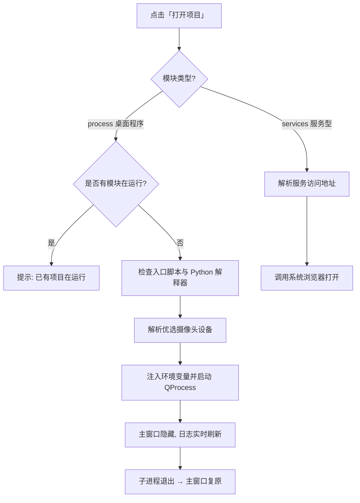

# AI Hub

> 统一启动器 —— 把五个独立的 AI 交互演示项目整合到一个桌面应用里，点一下就能运行。

AI Hub 基于 **PySide6** 构建，为 Quectel Pi 开发板上的五个演示项目提供统一的图形化入口：左侧选择模块，右侧查看项目简介、界面预览图和操作指南，一键启动对应程序。内置**中英文双语**切换、**子进程日志**面板与**摄像头自动选择**能力，避免多个演示程序各自启动、抢占摄像头的混乱。

---

## 功能特性

| 特性 | 说明 |
|---|---|
| 🗂 **统一入口** | 五个模块集中在侧边栏列表，无需记忆各项目的启动命令与工作目录 |
| 🌏 **中英双语** | 界面、项目简介与操作指南同步切换，语言偏好持久保存 |
| 🖼 **界面预览** | 每个模块展示实际运行截图，未就绪时给出明确占位提示 |
| 📖 **操作指南** | 手势、眼控等模块提供图文卡片式操作说明 |
| 📋 **子进程日志** | 实时捕获被启动程序的 stdout / stderr，便于排查问题 |
| 📷 **摄像头优选** | 自动识别 UGREEN 摄像头并注入设备号，避免多程序争抢同一个 `/dev/video*` |
| 🔒 **单实例保护** | 通过锁文件防止 AI Hub 重复启动 |
| 🎯 **互斥运行** | 同一时刻只允许一个模块运行，启动时自动回收主窗口 |

---

## 五个模块

| # | 模块 | Module | 类型 | 说明 |
|---|---|---|---|---|
| 01 | 手势遥控器 | Gesture Remote | 桌面程序 | 实时手势识别控制视频播放：手掌播放/暂停，左右滑动快进快退，上下滑动调节音量 |
| 02 | 眼控遥控器 | Eye Remote | 桌面程序 | 基于眼部状态与视线判断：注视屏幕继续播放，闭眼或移开视线自动暂停 |
| 03 | 双目测距 | Stereo Ranging | 桌面程序 | 双目摄像头 + SGBM 立体匹配，点击画面任意目标点即可测得真实距离 |
| 04 | 人脸变换 | Face Transform | 桌面程序 | 采集人脸后调用云端视觉能力，生成年龄变化 / 动漫化 / 性别转换特效 |
| 05 | 智能NAS系统 | Smart NAS | 服务型 | 整合文件管理、知识检索、媒体下载与语音交互，通过浏览器访问 Web 界面 |

各模块的完整源码位于**本仓库之外**的独立目录（详见下方[目录约定](#目录约定)），本仓库只维护启动器本身。

---

## 目录结构

```
ai-hub/
├── main.py          # 启动器主程序（约 1170 行，包含 UI、配置与启动逻辑）
├── asset/           # 图标资源
│   ├── eye.png
│   ├── gesture_fist.svg      # 握拳 → 暂停
│   ├── gesture_palm.svg      # 张开手掌 → 播放
│   ├── gesture_left.svg      # 左滑 → 快退 5 秒
│   ├── gesture_right.svg     # 右滑 → 快进 5 秒
│   ├── gesture_up.svg        # 上滑 → 音量 +
│   └── gesture_down.svg      # 下滑 → 音量 −
├── .gitignore
└── README.md
```

### 目录约定

启动器默认按下面的位置查找五个项目，**请保持同级目录布局**（路径可在 `APP_SPECS` 中修改）：

```
/home/pi/
├── ai-hub/                              ← 本仓库
├── demo-gesture-remote-control/
├── demo-eye-remote-control/
├── demo-camera-distance-measurement/
├── Project/
│   └── demo-face-transform/
└── ai-nas/
```

---

## 环境要求

- **操作系统**：Linux 桌面环境（需要图形界面，本机为 Quectel Pi 开发板）
- **Python**：3.10 及以上（开发环境使用 `pyenv 3.10.15`）
- **依赖库**：

  ```bash
  pip install PySide6
  ```

- 各演示项目自身的依赖需**单独安装**，启动器不负责管理。

---

## 快速开始

```bash
# 1. 进入启动器目录
cd /home/pi/ai-hub

# 2. 安装依赖
pip install PySide6

# 3. 启动
python main.py
```

启动后：

1. 在左侧列表点击要运行的模块（如「01 手势遥控器」）；
2. 右侧会显示项目简介、界面预览与操作指南；
3. 点击 **打开项目** —— 桌面程序类模块会拉起子进程，服务类模块会打开浏览器。

> 💡 点击右上角 **EN / 中文** 按钮可切换语言，选择结果会自动保存。

---

## 运行机制



### 两种模块类型

- **`process`（桌面程序）** —— 通过 `QProcess` 拉起一个本地进程，运行期间 AI Hub 窗口自动隐藏，退出后自动复原。可启动的最大数量为 1，避免摄像头等独占资源冲突。
- **`services`（服务型）** —— 不启动进程，直接调用系统浏览器打开服务地址。智能 NAS 模块会先执行 `./oc.sh casaos-url` 动态解析真实访问地址，解析失败则回退到 `http://127.0.0.1:28083`。

### 摄像头自动优选

手势、眼控、人脸变换三个模块需要在启动前确定使用哪个摄像头。启动器会按以下优先级查找：

1. `/dev/v4l/by-id/*UGREEN*video-index0`（UGREEN 摄像头）
2. `/dev/v4l/by-id/*video-index0`（任意第一路摄像头）

找到后通过环境变量传递给子进程，避免程序自行遍历设备导致选错：

| 环境变量 | 含义 |
|---|---|
| `AI_HUB_CAMERA_DEVICE` | 摄像头设备节点路径（已解析为真实设备） |
| `AI_HUB_CAMERA_INDEX` | 设备序号（如 `video0` 中的 `0`） |

### 互斥保护

- **单实例锁**：使用 `/tmp/ai-hub.lock`，重复启动会提示「AI Hub 已在运行」。
- **自启服务回收**：启动时自动停止可能抢占摄像头的用户级 systemd 服务 `gesture-remote-control` 与 `eye-remote-control`。

---

## 自定义与扩展

### 修改现有模块

所有模块定义集中在 `main.py` 的 `APP_SPECS` 列表中，每一项的关键字段：

| 字段 | 说明 |
|---|---|
| `app_id` | 模块唯一标识，同时用于关联操作指南 |
| `order` | 侧边栏显示顺序 |
| `title` / `title_en` | 中英文模块名称 |
| `intro` / `intro_en` | 中英文项目简介 |
| `kind` | `process`（启动进程）或 `services`（打开网页） |
| `python_bin` | 解释器路径；不存在时自动回退到当前 `sys.executable` |
| `cwd` | 子进程工作目录 |
| `script` | 入口脚本路径 |
| `launch_url` | `services` 类型的访问地址 |
| `preview_image` | 界面预览图路径 |

### 新增一个模块

在 `APP_SPECS` 末尾追加一项即可，无需改动 UI 代码：

```python
AppSpec(
    app_id="my_demo",
    order=6,
    title="我的演示",
    title_en="My Demo",
    intro="中文简介……",
    intro_en="English intro …",
    kind="process",
    python_bin="/usr/bin/python3",
    cwd="/home/pi/my-demo/src",
    script="/home/pi/my-demo/src/main.py",
    preview_image="/home/pi/my-demo/assets/screenshot.png",
),
```

若还想提供**图文操作指南**，可在 `APP_CARD_GUIDES` 中按 `app_id` 补充卡片数据（图标、标题、说明），或使用 `APP_GUIDES` 提供纯文本指南。

---

## 注意事项

- ⚠️ **路径为绝对路径**：`APP_SPECS` 中默认写死 `/home/pi/...`。换机器或换用户部署时，**必须**按实际位置修改 `script`、`cwd`、`python_bin` 与 `preview_image`。
- ⚠️ **智能 NAS 需先行部署**：该模块依赖 CasaOS、OpenClaw 等容器服务与 `voice-bridge` 服务，使用前请先在项目目录执行 `./install.sh`。
- ⚠️ **人脸变换需虚拟环境**：其入口 `start.sh` 依赖 `/home/pi/Project/.venv`，首次运行会自动创建虚拟环境，但依赖包需另行安装。
- 📌 **预览图缺失不影响使用**：未找到预览图时界面显示「暂无预览图」，功能不受影响。
- 📌 **仅支持单模块运行**：如需同时演示多个模块，请分别手动启动。

---

## 开源协议

本项目为 Quectel Pi 演示方案的一部分，具体协议请参见仓库根目录说明或联系维护者。
